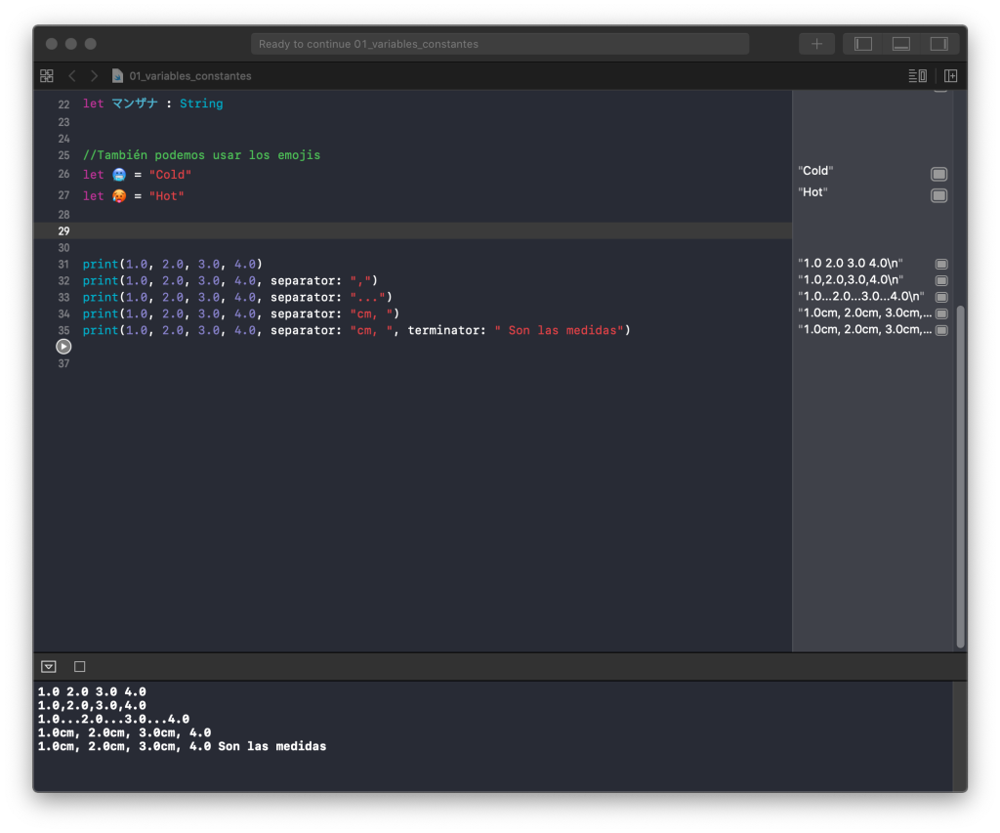

# Curso de Introducción a Swift

## Indice

## Referencias

[Swift Tutorial - Tutlane](https://www.tutlane.com/tutorial/swift)

[GitHub - saulscs/Swift-started: Swift started](https://github.com/saulscs/Swift-started)

[Tema 1.pdf](docs/Tema_1.pdf)

[Tema 2.pdf](docs/Tema_2.pdf)

[Tema 3.pdf](docs/Tema_3.pdf)

## Variables, constantes y comentarios 

### Variables y contantes

Las variables y las constantes son contenedores que sirven para guardar el valor de cualquier cosa.

- una constante (let): No cambia de valor.  estas utilizan màs RAM por el hecho de que pueden cambiar
- una variable (var): Va cambiando a lo largo del programa**Sintaxis**Use **let** para hacer una constante.Use **var** para hacer una variable.  estas ya tienen un espacio de RAM definido

### ¿Cómo funcionan los Type Annotations?

Los Type Annotations facilitan la creacion de variables con valores dinamicos, a diferencia de las constantes que siempre son el mismo al ser declarados

Es importante conocer los tipos de datos que acepta Swift a la hora de declarar su tipo de dato.

Podemos asignar un tipo a varias variables declaradas en las misma linea 

```swift
var red, green, blue: Double
```

### Nomenclatura para nombrar variables

**Camel case:** a veces lo escriben CamelCase, es un estilo de escritura que aplica a un conjunto de palabras, Esto se debe a que siempre se escribe con mayúscula la primera letra de cada palabra, haciendo que se asemeje a las jorobas de un camello. Ejemplo:

`var UnaVariableNueva`

Existen dos tipos de CamelCase:

- UpperCamelCase: donde todas las primeras letras de cada palabra se escribe en mayúscula. Ejemplo:

`var UnaVariableNueva`

- lowerCamelCase: es similar al primer caso, pero la primera letra de la primera palabra se escribe en minúscula. Ejemplo:

`var unaVariableNueva`

**Snake case**: a veces lo escriben snake_case, es otra forma de escribir nuestras variables, colocando un guión abajo (_) luego de cada palabra. Sin embargo, este no es el estándar de Swift para nombrar variables. Ejemplo:

`var una_variable_nueva`

En resumen, la forma recomendable de escribir nuestras variables en Swift es **camelCase.** Otra recomendación es que todas nuestras variables y constantes sean escritas en inglés, ya que una peculiaridad del idioma es que no cuenta con otros signos como tildes, diérisis, etc.

### Imprimir valores con la función print

La función print es una función global, es decir puede ser usada en todas las partes del programa que estamos desarrollando.

Lo que realiza es mostrar en la consola una cadena de texto. Esta cadena debe estar entre doble comilla. Por ejemplo, vamos a escribir el siguiente comando en nuestro Playground:

`print("Esta es una prueba del print")`

Interpolación de cadenas (String Interpolation)

Como ejemplo, trabajaremos con el primer ejercicio que realizamos que contiene una constante (*maximumNumberOfLoginAttempts*)  y una variable (*currentLoginAttempt*) que  mostraba el número máximo de intentos que tenemos para hacer un login y las veces de intentos actuales, pero agregaremos texto para que sea entendible mirando desde la consola.

```swift
print("El número de intentos actuales es: \(currentLoginAttempt) de un total disponible de: \(maximumNUmberOfLoginAttempts)")
```

La función **print** tiene otras funcionalidades. Un caso puede ser cuando tratamos de imprimir muchos valores. **print** nos permite cambiar el separador (en vez de coma podemos elegir lo que queramos) o terminador (terminar con algún otra cadena) de lo que mostraremos en consola.

Por ejemplo, colocaremos cinco líneas donde:

- El primero no llevará separador,
- Los siguientes tres casos usarán separador y
- El último caso usará separador y terminador.



## Tipos de datos

### Enteros

Siempre que vayamos a utilizar una variable de entero y queramos colocarle un tipo de dato, debemos pensar el tamaño que tendrá este y así asignarle el tipo de dato correspondiente.

Un Ejemplo es la edad de una persona no necesita un valor tan alto, por lo que podemos declararle UInt8 para que no tenga valores negativos y es poco probable que una persona viva más de 255 años.

### Floats y Doubles

**Float** : es un tipo de dato decimal (14.1342) tiene 6 digitos despues del punto, despues de esa cantidad de digitos redondea.

**Double**:es un tipo de dato decimal similar al float solo que tiene el doble de digitos despues del punto por lo que podemos ser mas exactos en cuanto un numero o cantidad.

si necesitas hacer un cálculo muy exacto es mejor usar Double, sino Float.

Literales numéricos

Si queremos que un entero no sea negativo le ponemos UInt8 y esto mandara error

```swift
let cannotBeNegative: UInit8 = -1
```

### Convertir entre tipos de datos

Si en vez de querer hacer un truncamiento queréis redondear un número Float:

1. Debeis importar la librería Foundation

```swift
import Foundation

```

1. Y aplicar la función round() a la variable o constante

```swift
let age : Float = 17.6
round(age) // age == 18
```

### Tuplas

es como un tipo de Array y Objeto que puede tener diferente tipos de variables dentro aunque es más fácil verlo como un Objeto.

Ahora, en este tipo de lenguajes de programación siempre es buena idea no dejar sin declarar el tipo de variables que tendrá la Tupla (Tuple en inglés). La forma de hacerlo es de la siguiente forma:

```swift
let httpError: (Int, String) = (404, "Page not found") // Si quieren crearlo como un tipo de Array
let httpErrorObject: (errorType: Int, message: String) = (errorType: 404, message: "Page not found") // Si quieren tratarlos como Objetos
```

### Optionals y Nil

nil != null para los que viene de otro lenguaje de programación

- nil (ausencia de valor)
- null (apuntador a objeto vacío)

Sirve cuando no sabemos si una variable va a tener valor.   

Cuando algo es opcional nuestro deber es saber que tipo de dato es o si algo es nulo además de crear las validaciones necesarias para esto o hacer casting. 

## Manejo de Optionals

### Force unwrapping de una variable optional

force unwrapping es establecer en una optional un valor definido mediante la utilización de la variable acompañado de !

Solo usar el Unwrapping solo si estamos seguros que el valor no puede ser Nil

Rodear el print o wrapping para saber si es nulo o no

### Optional Binding

Es una forma más elegante y optima para evitar el force unwarpping

las constantes no deberian ser nulas

Estructura para usar **el** valor **no** optional de **una** variable sin hacer **el** uso de **el** force unwrapping
**se** crea otra constante **a** partir de **la** variable optional

## Gestión de Errores

### Uso de try y catch

o es buena practica de software manejar business logic con try and catch . Hace la curva de aprendizaje y el software mas complejo . For instance se puede usar cuando se conneta a un webservice y se cae la conexion de datos , hay es una buena practica para el try{}catch

try{webservice.login(){catch(Exception e){throw new ConnectionDown();}

### Aserciones y Precondiciones

La función assert() te permite verificar el estado de tu programa en tiempo de ejecución y fallar si las cosas no son como deberían ser. Una de las características interesantes de assert() es que se elimina automáticamente cuando construyes tu aplicación en modo de lanzamiento, pero si no queres que eso suceda, si queres que tu aplicación se bloquee si algo está muy mal, entonces deberías usar la función precondition() en su lugar.

```swift
let age = -5
assert(age >= 0, "La edad de una persona no puede ser negativa."
```

precondition() funciona de manera idéntica a assert(): dale una condición para verificar junto con un mensaje opcional para imprimir si la verificación falla. En tiempo de ejecución, incluso en el modo de liberación, Swift ejecutará la verificación por vos y se bloqueará si falla.

```swift
precondition(age >= 0, "La edad de una persona no puede ser negativa.")
```

En ambos casos devuelve este error:

```swift
error: Execution was interrupted, reason: EXC_BAD_INSTRUCTION (code=EXC_I386_INVOP, subcode=0x0).
The process has been left at the point where it was interrupted, use “thread return -x” to return to the state before expression evaluation.
```

Falta aclarar que pese a que assert y precondition son iguales, assert solo funciona en modo debug mientras que precondition funciona en debug y producción.