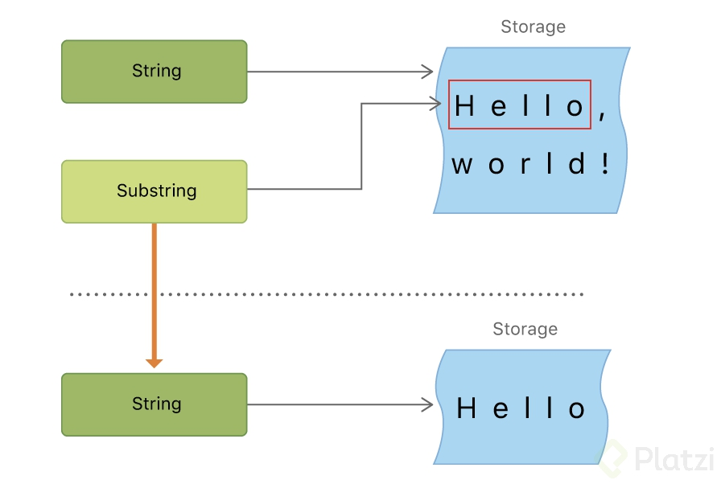
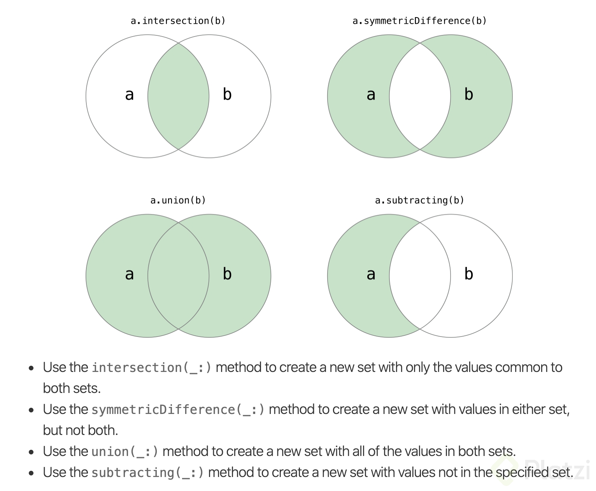
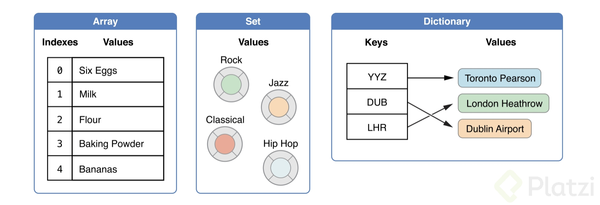

# Curso de Programación en Swift

## Indice

## Referencias

[100 Days of Swift - Hacking with Swift](https://www.hackingwithswift.com/100)

[Basic Operators - The Swift Programming Language (Swift 5.5)](https://docs.swift.org/swift-book/LanguageGuide/BasicOperators.html)

[Tema4.pdf](docs/Tema4.pdf)

## Condicionales y operaciones básicas

### Operaciones de asignación y aritmeticas

El módulo es un operador binario a % b que define cuántos múltiplos
de b entrarán en a y devuelve el valor que queda fuera. 

Modulo solo funciona con numeros enteros. 

### Comparación

Igual a ( a == b ) 

No es igual a ( a != b ) 

Mayor que ( a > b )

Menor que ( a < b )

Mayor e igual que ( a >= b )

Menor e igual que ( a <= b )

Cada uno de los operadores de comparación devuelve un valor Booleano para indicar si la declaración es verdadera o no

```
1 == 1   // true because 1 is equalto 1
2 != 1   // true because 2 isnot equalto 1
2 > 1    // true because 2 is greater than 1
1 < 2    // true because 1 is less than 2
1 >= 1   // true because 1 is greater thanor equalto 1
2 <= 1   // false because 2 isnot less thanor equalto 1

```

Los bool no se pueden comparar con < o > solo con igualdad

## Manipulación de Strings

### **Inicialización y mutabilidad**

Si el string esta guardado en un let no sumara ya que las constantes son inmutbles.

Nunca querer concadenar constantes.

Si un tipo de dato en (especial las strings) es evaluado al hacer una copia el uno de la otra estas copias son independientes viven en lugares diferentes de la RAM. También los bool y enteros, floats, doubles.

### **Characters**

String con solo una letra

Cuando tenemos un string podemos usar el metodo appen en vez de hacer un casteo

### **Substrings**

Extraer una pequeña parte del string 

Siempre tenemos que convertir el Substring a String para que se guarde como un objeto en memoria

Un substring es un pointer hacia el comienzo de la subcadena del string original.



## Estructuras de datos

### Conjuntos

En un conjunto no existe un orden como tal, asi como tampoco puede haber elementos repetidos. 

Tenemos que añadir objetos que sean comparables. 

Si queremos hacer conjuntos con cosas no comparables tenemos que recurrir a los protocolos hashable o ecuatable.

Los conjuntos tambien es una forma de tener objetos en swift, es lo más aproximado a como se usan los objetos en JavaScript

### **Iteraciones y operaciones sobre conjuntos**



### **Diccionarios**

En un diccionario volvemos a no tener posición, se accede por clave.

El objeto definido tendra un valor.

Diferencias entre tuplas y diccionarios:

- Las tuplas pueden o no tener una llave.
- Las tuplas solo pueden contener una cantidad predefinida de valores
- Las tuplas pueden combinar varios tipos de valores, mientras que los diccionarios tiene un solo tipo homogéneo.

Tupla:

```swift
let tuple: (key1: String, key2: Float, key3: Int) = (key1: "value 1", key2: 3.1415, key3: 64)

```

Diccionario:

```swift
let dictionary: [String: String] = ["key 1": "value 1", "key 2": "value 2"]

```

[https://stackoverflow.com/questions/27631137/tuple-vs-dictionary-differences](https://stackoverflow.com/questions/27631137/tuple-vs-dictionary-differences)

### **Iteración en diccionarios**



## Sentencias de transferencia de control

### **Uso de return y guard**

El guard transifiere el contol despues de la llave si es verdadero pero si no se ejecuta lo que esta dentro de la llave

El guard se utiliza dentro de una **función** para realizar un unwrapping de los opcionales. Si encuentra nil dentro, finalizará la función, bucle o cualquier condición usada.

Cómo se utiliza

```swift
guardlet surname = person["surname"]else {
return
}

```

El uso del `guard let` se lee de la siguiente manera:

Si alguien puede crear (`let`) la variable *”surname”* a partir de *person[“surname”]*, `guard` transfiere el control después de las llaves “{}” (fuera de su scope).

Caso contrario, se finaliza con `return`.

Ejemplo:

```swift
var people = ["name": "Juan Gabriel", "age": 31, "isMale":true]as [String :Any]

functestUserValidation(person:[String:Any]) {
guardlet surname = person["surname"]else {
        /*
         En este punto no se pudo crear la constante `surname` porque la key “surname” no existe en el diccionario `people`.
         */
        print("El apellido es desconocido")
return
    }
    // Aqui existe surname
    print(surname)

guardlet age = person["age"]else {
        print("La edad es desconocida")
return
    }
    print("La edad de la persona es \(age)")
}

testUserValidation(person: people)

```

El resultado de esta función es:

```swift
El apellido es desconocido

```

Porque entra en el `else` del primer `guard`, imprime el mensaje y corta la ejecución de la función con el `return`.

Si agregamos la siguiente linea justo antes de la llamada a la función:

```swift
people["surname"] = "Gomila"
testUserValidation(person: people)

```

la salida en consola es:

```swift
Gomila
La edad de la persona es 31
```